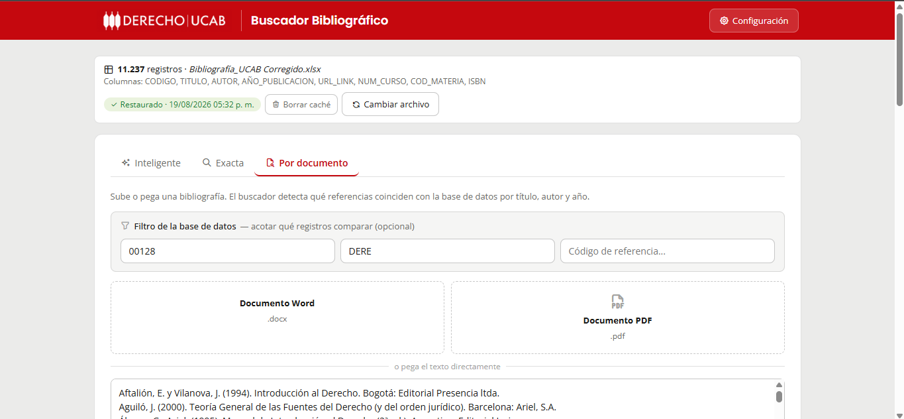
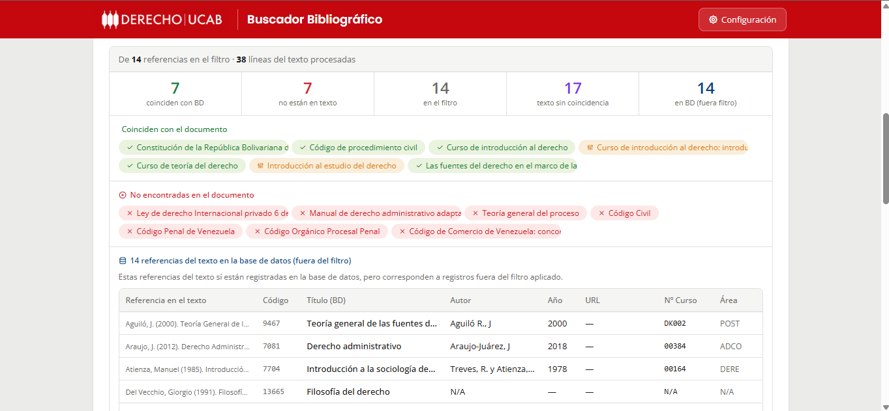
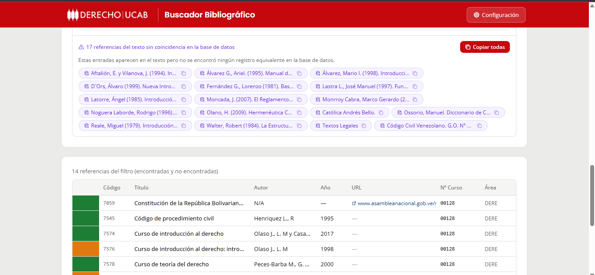

🇪🇸 Español | 🇺🇸 [English](README.en.md)

# Buscador Bibliográfico · UCAB Derecho

Herramienta web que verifica, contra el sistema oficial de la universidad, qué
referencias de un programa de materia ya están registradas, cuáles están mal
vinculadas al curso y cuáles nunca se cargaron — un cotejo que hoy se hace a mano,
línea por línea.

**Un solo archivo HTML. Sin backend, sin instalación. Se abre con doble clic.**



---

## El problema

En la Facultad de Derecho de la UCAB, cada programa de materia trae una bibliografía
de decenas de referencias. Para saber si esas obras están disponibles para los
estudiantes, alguien tiene que revisar, **una por una**, si cada referencia ya está
cargada en **Banner 9** (el sistema académico oficial) y correctamente vinculada al
curso.

Ese cotejo manual es lento y propenso a errores: hay que distinguir tres situaciones
distintas que a simple vista se confunden —

1. La obra **ya está** en el sistema y vinculada al curso correcto.
2. La obra **existe** en el sistema pero **no está vinculada** a ese curso (mal
   catalogada).
3. La obra **nunca se registró** y hay que cargarla.

Esta herramienta automatiza ese cotejo: se carga la base bibliográfica oficial
(exportada de Banner 9, **11.237 registros**), se pega la bibliografía de un programa,
y en segundos clasifica cada referencia en la categoría que le corresponde.

---

## Cómo funciona — cotejo por documento

El corazón de la app. Se pega o se sube la bibliografía (texto, Word `.docx` o PDF) y
cada referencia se clasifica y se colorea según su estado.

**Resumen instantáneo.** Cada referencia del programa cae en una de cuatro categorías,
contadas y listadas en chips de colores:



| Color | Categoría | Qué significa para el cotejo |
|---|---|---|
| 🟢 **Verde** | Coincide | La referencia ya está cargada y vinculada al curso. |
| 🔵 **Azul** | En la base, fuera del filtro | Existe en el sistema, pero **no** vinculada a este curso (mal catalogada). |
| 🟣 **Violeta** | Sin coincidencia | **Nunca se registró** — hay que cargarla a Banner 9. |
| 🔴 **Rojo** | No citada | Registros que el sistema tiene para el curso y que el programa no menciona. |

**Detalle registro por registro.** Cada fila lleva su barra de estado del color
correspondiente, y las referencias faltantes se copian de un clic para pasárselas a
quien las carga al sistema:



El emparejamiento es **puramente léxico** (sin IA de por medio): compara título exacto,
solapamiento de palabras clave (ignorando *stopwords*), rachas de frase contigua, y
confirma con autor, año e ISBN. Las reglas son conservadoras para no dar falsos
positivos: el año por sí solo nunca confirma un match, y los títulos cortos exigen
coincidencia de autor.

Las referencias **sin coincidencia** (las que hay que cargar) se copian con un botón
—individualmente o todas de una vez— para pasárselas directo a quien las registra en
el sistema.

---

## Funcionalidades

- **Tres modos de búsqueda:**
  - **Por documento** — el cotejo masivo descrito arriba, con las cuatro categorías.
  - **Exacta** — filtro por campos (código, título, autor, año, curso, área) que se
    aplica en vivo mientras se escribe.
  - **Inteligente (opcional)** — convierte una consulta en lenguaje natural en filtros,
    usando la API de Anthropic. Requiere una API key propia; sin ella, los otros dos
    modos funcionan sin límites.
- **Sistema de 4 categorías coloreadas** que responde, de un vistazo, las tres
  preguntas del cotejo manual.
- **Botón de copiado** para las referencias faltantes (categoría "sin coincidencia").
- **Persistencia local** (`localStorage`): al recargar ofrece restaurar la última base
  cargada.

---

## Stack técnico

- **HTML + CSS + JavaScript vanilla**, todo en **un único archivo**. Sin frameworks,
  sin backend, sin paso de build.
- Corre en cualquier navegador moderno — doble clic o servido como archivo estático.
- Lectura de Excel/Word/PDF en el navegador vía librerías por CDN (SheetJS, mammoth.js,
  pdf.js), cargadas **con SRI** (`integrity` + `crossorigin`).
- Identidad visual de UCAB Derecho: rojo institucional `#c5080e`, tipografías Poppins +
  Open Sans, logo oficial. Tema claro.

Que sea un solo archivo es una decisión de diseño: la herramienta la usa personal
administrativo sin entorno técnico, así que tenía que abrirse sin instalar nada y sin
depender de un servidor.

---

## Proceso de ingeniería

El proyecto no se quedó en "funciona": pasó por varias etapas de endurecimiento,
todas trazables en el historial de commits.

- **Auditoría de seguridad.** Se añadió *Subresource Integrity* a los recursos de CDN
  (protege ante un CDN comprometido que pudiera inyectar código), validación de esquema
  en las URLs de la base (solo `http`/`https`, cerrando esquemas peligrosos como
  `javascript:`) y manejo explícito de errores de lectura de archivos.
- **Corrección de precisión del matching, validada con datos reales.** Se cerró un
  falso positivo concreto (una cita que se emparejaba con el autor equivocado)
  endureciendo la regla de coincidencia por título, y se verificó el resultado contra
  la base completa de 11.237 registros para confirmar que no rompía coincidencias
  legítimas.
- **Optimización de rendimiento.** Los metadatos derivados de cada registro (título
  normalizado, señales de autor, palabras clave) se precomputan una sola vez al cargar
  la base y se reutilizan, en lugar de recalcularse en cada comparación. En pruebas con
  la base real completa, el tiempo de cotejo bajó de ~1996 ms a ~1235 ms.

---

## Cómo correrlo localmente

No requiere instalación ni dependencias.

1. Clona o descarga el repositorio.
2. Abre `buscador_bibliografico_ucab.html` en el navegador (doble clic).
3. Sube tu base bibliográfica en Excel (o restaura la última guardada).
4. Elige un modo de búsqueda y empieza.

> Para la **búsqueda inteligente** (opcional), pega tu propia API key de Anthropic en
> Configuración. Se guarda solo en tu navegador (`localStorage`) y nunca sale de tu
> equipo.

Si prefieres servirlo como archivo estático (por ejemplo para probar la carga de
`.docx`/`.pdf` sin restricciones de `file://`), cualquier servidor estático sirve.

---

## Estructura del proyecto

```
buscador_bibliografico_ucab.html   La app completa (HTML + CSS + JS en un archivo)
DESIGN.md                          Guía de identidad visual (paleta, tipografía, componentes)
README.md                          Este archivo
README.en.md                       Versión en inglés
LICENSE                            Licencia MIT del código + nota sobre la marca UCAB
docs/                               Capturas usadas en el README
```

---

## Licencia

Código bajo licencia [MIT](LICENSE). El nombre, logo e identidad visual de
"UCAB Derecho" son marca de la Universidad Católica Andrés Bello, se usan aquí
solo con fines demostrativos/de portafolio, y **no** están cubiertos por esta
licencia.
